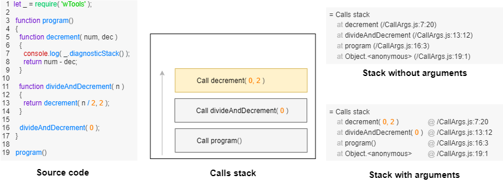

# Errors handling done right: stateful exceptions

### Abstract

The state of the art techniques of handling errors.

Poor error reporting technique slows down software development. Asynchronous errors complicate the problem of generating a readable and informative error report.

There are several things thrown error could possibly communicate to an engineer:

- Calls stack
- Arguments
- Asynchronous calls stack
- Throws stack
- Source code
- Message
- Is brief
- Was it logged
- Was it attended
- ID


### Constructing an error

Use routine `_.err` to construct an error object. Source code of the most straightforward example you may see below.

``` js

try
{
  throw _.error.err( 'Simplest error example' );
}
catch( err )
{
  console.log( err );
  throw err;
}

```

Such a program outputs the log below.

```
= Message of error#1
   Simplest error example

= Beautified calls stack
   at Object.<anonymous> (/Simplest.js:4:11)

= Throws stack
   caught at Object.? @ /Simplest.js:4
```

Routine `_.err` constructs an error. This routine expects any number of arguments. Routine `_.err` concatenates all input arguments into one error. If it finds an error object in arguments, it reuses the error instead of making a new one.

### Calls stack

Hardly possible to find a programming language that ships that from the box. Stack of calls in the error report is useful to locate the location in source code where the error was thrown.

In our implementation, calls stack is stored in the `callsStack` field of an error.

### Stack with arguments

Just knowing which functions were called is good. Knowing what arguments were used gives much more information about the state. There are two obstacles to include such information in an error report. It’s challenging to implement the feature in JS without dramatical performance overhead. Another challenge is formatting text derived from the arguments which have arbitrary data structure.



On the diagram above, you may see how stack with embedded arguments could look like compared to ordinary stack.

Our implementation does not include arguments of calls in an error report.

### Asynchronous calls stack

Most programs are asynchronous. That’s why knowing the current state of the call stack could be not quite useful. Gathering information about asynchronous calls decreases performance.

``` js
function program()
{
  let consequence = new _.Consequence();
  consequence.then( function asyncCallback( arg )
  {
    if( arg >= 0 )
    return arg-1;
    else
    throw _.error.err( 'Example' );
  });
  consequence.take( -1 );
}
```

It would be useful to have in the report of error thrown from `routine asyncCallback` calls stack of `routine program`.

```

 = Message of error#1
    Example

 = Beautified calls stack
    at wConsequence.asyncCallback (AsyncStack2.js:16:13)
    at wConsequence.take (Consequence.s:2900:8)
    at program (AsyncStack2.js:18:15)
    at Object.<anonymous> (AsyncStack2.js:6:1)
    at Module._compile (internal/modules/cjs/loader.js:777:30)

    at program (AsyncStack2.js:11:15)
    at Object.<anonymous> (AsyncStack2.js:6:1)
    at Module._compile (internal/modules/cjs/loader.js:777:30)

 = Throws stack
    thrown at wConsequence.asyncCallback @ AsyncStack2.js:16
    thrown at attend @ abase\l0\l9\Setup.s:94
    thrown at errLog @ abase\l0\l9\Setup.s:57
    thrown at errLog @ abase\l0\l9\Setup.s:59

 = Process
    Current path : C:\example
    Exec path : C:\Program Files\nodejs\node.exe AsyncStack2.js

 = Source code from AsyncStack2.js:16
      14 :     return arg-1;
      15 :     else
    * 16 :     throw _.error.err( 'Example' );
      17 :   });
      18 :   consequence.take( -1 );

```

That code produces such an error report. Asynchronous calls stack goes just after synchronous calls stack. Top of the asynchronous stack is `at program (AsyncStack2.js:11:15)`.

Native built-in algorithm of gathering async stack does not work properly for consequences, and it produces stack for time out calls which difficult to read. In Nodes, such stack has many calls of irrelevant internal routines.

Our implementation has limited and experimental support of asynchronous calls stack in error reports.

### Throws stack

Throws stack gives information about order and locations in the source code of throws of an error. `Try block` catches thrown error from the code in the block. Catching an error `try block` puts a record about its location in the throws stack and throws it. The next `try block` can catch it again. It can either rethrow it or log it. Routine `_.err` is helpful to either rethrow error or log it. The routine appends the stack of throws with the new location. That's how we get a stack of throws. It could be useful to track the propagation of an error in the chain of `try blocks`. Its length is always shorter or equal than calls stack. The first element of the stack is the location where the error was thrown initially, and each other locations were rethrown.

``` js

function decrement( i )
{
  try
  {
    if( i <= 0 )
    throw _.error.err( 'negative!' );
    return i-1;
  }
  catch( err )
  {
    throw _.error.err( err, '\nFailed to decrement' );
  }
}

function divide( i )
{
  try
  {
    if( i % 2 === 1 )
    throw _.error.err( 'odd!' );
    return decrement( i / 2 );
  }
  catch( err )
  {
    throw _.error.err( err, '\nFailed to divide' );
  }
}

divide( 0 );

```

This example throws error at line `throw _.error.err( 'odd!' )`. Line `throw _.error.err( err, '\nFailed to decrement' )` rethrow the error. Information about that is added to error by routine `_.err`. Same thing happen at line `throw _.error.err( err, '\nFailed to divide' )`.

```

= Beautified calls stack
   at decrement (ThrowsStack.js:6:13)
   at divide (ThrowsStack.js:21:12)
   at Object.<anonymous> (ThrowsStack.js:29:1)
   at Module._compile (internal/modules/cjs/loader.js:777:30)

= Throws stack
   thrown at decrement @ ThrowsStack.js:6
   thrown at decrement @ ThrowsStack.js:11
   thrown at divide @ ThrowsStack.js:25
   thrown at attend @ abase\l0\l9\Setup.s:94
   thrown at errLog @ abase\l0\l9\Setup.s:57
   thrown at errLog @ abase\l0\l9\Setup.s:59

```

Above, you may see a fragment of error report with throws stack of the example.

Our implementation collects throws into a stack. In the current implementation, throws stack has its own section. But in smarter implementation, throws stack could be integrated into calls stack. It's possible to decrease the length of error report merging information of two stacks into one section.

### Message

A developer can communicate information about the expected behavior of an algorithm writing explanation in the message of an error. A developer can add extra dynamic information, which is not included in the error report automatically. Most often, a chain of `try block` rethrow the same error multiple times, appending a message with extra information in the same manner as throws stack is appended by the location where the error is rethrown. It does not happen automatically, and a developer should define a new message explicitly. However, a developer can get assistance in concatenating a message from substrings or entities of different types.

In our implementation routine `_.err` produces an error from arguments, and if any of the arguments were an error, then the routine reuse the error instead of creating new error, amending it.

Here you may see an example of proper message amending.

``` js
function decrement( i )
{
  try
  {
    if( i <= 0 )
    throw _.error.err( 'negative!' );
    return i-1;
  }
  catch( err )
  {
    throw _.error.err( err, '\nFailed to decrement' );
  }
}

function divide( i )
{
  try
  {
    if( i % 2 === 1 )
    throw _.error.err( 'odd!' );
    return decrement( i / 2 );
  }
  catch( err )
  {
    throw _.error.err( err, '\nFailed to divide' );
  }
}

divide( 0 );

```

Line `throw _.error.err( 'negative!' )` throws an error. Line `throw _.error.err( err, '\nFailed to decrement' )` rethrows it amending the message with `Failed to decrement`, and the line `throw _.error.err( err, '\nFailed to divide' )` rethrows it amending the message with `Failed to divide`. In the log, a developer sees a multiline message which mimics stack of throws.

```
= Message of error#1
   negative!
   Failed to decrement
   Failed to divide
```

Above, you may see a fragment of error report with the logged message.

### Statefulness of an error

Nobody wants to see duplicates of an error in a log. Right? If a program has chains of `try blocks` it can happen. How to avoid it? The handy technique is the statefulness of an error object. Changing a field of an error object will make it possible to answer confidently on the question: "was the error logged?"

``` js
function decrement( i )
{
  try
  {
    if( i <= 0 )
    throw _.error.err( 'negative!' );
    return i-1;
  }
  catch( err )
  {
    err = _.error.err( err, '\nFailed to decrement' );
    if( _.error.once( err ) )
    console.log( err );
    throw err;
  }
}

function divide( i )
{
  try
  {
    if( i % 2 === 1 )
    throw _.error.err( 'odd!' );
    return decrement( i / 2 );
  }
  catch( err )
  {
    err = _.error.err( err );
    if( _.error.once( err ) )
    console.log( err );
    throw err;
  }
}

try
{
  divide( 0 );
}
catch( err )
{
  err = _.error.err( err );
  if( _.error.once( err ) )
  console.log( err );
}

```

In the example above, you may see that both `catch blocks` tries to log error. But only the first executed `catch block` does it because the error has a state which is changed by routine `_.error.once`. In the output, you will see only one error, no duplicates.

```
= Message of error#1
   negative!
   Failed to decrement

= Beautified calls stack
   at decrement (Once.js:6:13)
   at divide (Once.js:24:12)
   at Object.<anonymous> (Once.js:37:3)
   at Module._compile (internal/modules/cjs/loader.js:777:30)

= Throws stack
   thrown at decrement @ Once.js:6
   thrown at decrement @ Once.js:11
   thrown at decrement @ Once.js:12
```

In practice, the field `logged` is not enough. In our implementation, we also have a field `attended`. Accessors help to detect a moment of logging an error.

### Command-line user interface and brief errors

Implementing a command-line user interface ( CLI ) developer often needs to solve the problem of reporting bad input data. A sound error reporting system helps a developer to differentiate errors caused by the mistake of a user and errors caused by the mistake of a developer. End-user doesn't want to see stacks and extra information which are appreciated by the developer.

``` js

function decrement( i )
{
  try
  {
    if( i <= 0 )
    throw _.error.brief( 'Please, specify a positive number.' );
    return i-1;
  }
  catch( err )
  {
    debugger;
    console.log( err );
  }
}

decrement( 0 );

```

Above, you may see an example. It throws the error constructed with routine `_.error.brief`. The routine set field of the error indicating that the log of the error should have no stack or other extra information. The expected output is a single line of text:

```
Please, specify a positive number.
```

Brief errors are other manifestations of the technique explained in section [statefulness of an error](#statefulness-of-an-error).

### Tracking of an error and its IDs

Tracking of an error is easy if code is synchronous. But if the program becomes complicated and asynchronous, it is often not easy to understand which error where goes. To make tracking of errors more comfortable, let's add a field ID to error object. Let's log the ID with other diagnostic information. If the ID of an error stays the same from a run to a run of a program, then the developer may use the id to track it.

The ID of errors is another manifestation of the technique explained in section [statefulness of an error](#statefulness-of-an-error).

### Source code of an error

It's helpful to have a fragment of source code, which is the initiator of throwing the error.

``` js
try
{
  throw _.error.err( 'Simplest error example' );
}
catch( err )
{
  console.log( err );
  throw err;
}

```

The code above adds source code to the error report if module `Files` were included. Otherwise, the error report is not going to have the section `source code`. Such a program outputs the log below.

```
= Message of error#1
   Simplest error example

= Beautified calls stack
   at Object.<anonymous> (/Simplest.js:4:11)

= Throws stack
   caught at Object.? @ /Simplest.js:4

= Source code from /Simplest.js:6
    1 : try
    2 : {
  * 3 :   throw _.error.err( 'Simplest error sample' );
    4 : }
    5 : catch( err )
```

Our implementation adds a fragment of source code to error object and error report.

### Sections

Non-brief error report usually has several sections: message, calls stack, throws stack, source code, and other. Error object has a map of sections with corresponding records. Report generating algorithm use these sections to produce error report you see below.

```
= Message of error#1
   Simplest error example

= Beautified calls stack
   at Object.<anonymous> (/example/Simplest.js:4:11)

= Throws stack
   caught at Object.? @ /example/Simplest.js:4

= Process
  Current path : /example
  Exec path : /bin/node /example/Simplest.js

= Source code from /example/Simplest.js:6
    1 : try
    2 : {
  * 3 :   throw _.error.err( 'Simplest error sample' );
    4 : }
    5 : catch( err )
```

Field `sections` of error object is the map. Each record of the map has a head and a body. For example, the head of the first section of the log above is `Message of error#1`, and its body is `Simplest error example`. Section `Process` is custom. It is present in error report only if the error was caught by the unhandled error handler. Section `Process` has useful information about the current process.

A developer can add any custom section to the constructed error with the help of option `sections` of routine `_.err`. Such a section will become part of the error report. It is useful, for example, if the error should have a source code of shader or some custom information.

### Release build

Performance overhead should be minimized in release build. Collecting arguments, asynchronous calls stack, and other information which decreases performance should be off in release build.

### Summary

Statefulness of error is preferable because that technique lets solve problems:

- Of removing duplicates
- Of differentiation of user errors and developer errors
- Of tracking error

An error object should have fields and states. Despite the fact, the article is about JS, these techniques are applicable to other languages.
