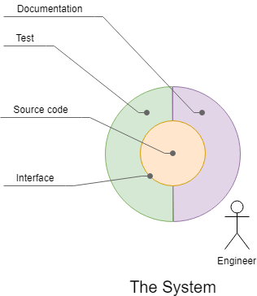
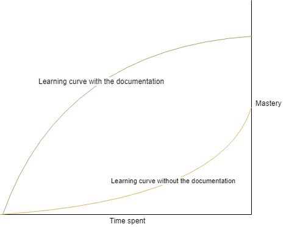
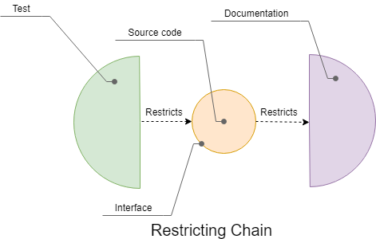
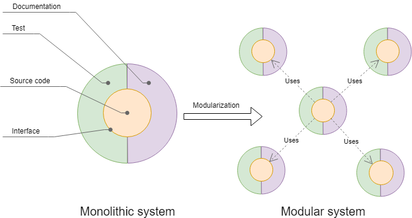
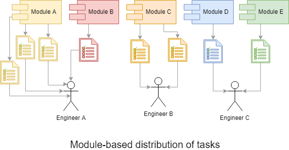
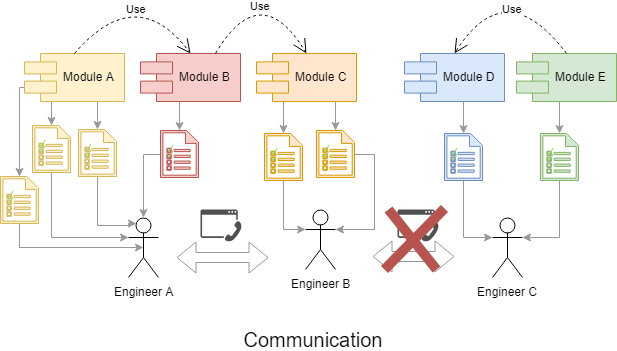

# Modularity of the system

This article describes differences between modular and monolithic systems, concepts behind it, and the effects of modularization on the workflow.

### The system and its components.

A system is a group of interacting or interrelated entities that form a unified whole.

Let's try to conceptualize what module is from an engineering perspective. In computer science module could be represented by 3 crucial components:

- Source code.
- Test.
- Documentation.

Similarly, in any other engineering field module consists of 3 components. The development of each part takes the relatively same time.

### Interface

The interface is a shared boundary between system components.

What is in common between documentation and source code? What is in a joint between source code and test? How interact with two modules of the system? The interface in general. The documentation describes either API of the system or UI. The test covers API of the system, either its UI. Two modules of the system interact through API. The interface is a glue that sticks together all components of the system.

In the diagram above, the interface is the borderline between all components of the system. Source code ( or any kind of blueprint ) is the core component of the system. Source code can exist and be functional itself, but the system should have the documentation as well as the test to make the interaction between the engineer and the system productive.

The interface can be conceptualized like a language between elements of the system. Documentation aims to describe all grammatically, and syntactically correct texts in human-human ( natural ) language and test do the same thing in human-machine ( programming ) language.

### Documentation

Documentation is a set of documents to describe the interface, its components, or concepts behind the system.

Documentation sharps learning curve of an engineer having limited knowledge about the system. Documentation becomes outdated if the interface undergoes changes.

In the diagram above, you may see the learning curve depending on the presence of documentation.

Such relations are evident:

- Documentation improves the analyzability of the system.
- More volatile interface - more cost of updating documentation.
- More documentation is written - more cost of updating documentation.
- Bigger team - more value from the documentation.
- No value from the documentation if the team is a single person unless it's end-user documentation.
- Documentation improves the cooperation of the team because it costs less for one team member to reuse the work of another.
- Documentation has cost, but it could decrease the overall cost of the system, improving the learning curve, and cooperation with the team.

### Test

The test is code or procedures which ensure that variation of input of the interface of the system produces expected output.

Test, as well as documentation, is based on an interface, either API or any kind of UI. The test is required to make sure interaction with the system produces expected results. Fixing interface unchangeable is a by-product of that. Unlike documentation, the test restricts source code, not the opposite. Changes in source code could cause a change of the interface that causes outdating of documentation, but source code cant be changed without changing test if the development process follows rules of test-driven development ( TDD ).

On the diagram above, you may see that the test restricts source code and source code restricts documentation. Changes in tests invalidate source code, but changes in source code invalidate documentation. This is valid if the test-driven development technique is followed.

Such relations are evident:

- Test improves the maintainability of the system, and the engineer becomes more confident about the code.
- Test improves the reliability and stability of the system, decreasing the number of bugs.
- Test encourages engineers to refactor the system making it more robust.
- Resilience test improves the resilience of the system.
- Negative testing enhances the fault tolerance of the system.
- The test can increase the portability of the system because it requires defined abstract interface what pushes engineer toward more abstract solutions decoupled from the platforms.
- Efficiency test improves efficiency and performance of the system, encouraging engineer to focus on performance issues.
- Test improve reusability of the system because tests leverage defining interfaces what is required for reusing the system as a module.
- Test make changing of the interface more costly.
- More times, the system reused more benefit from tests. The system which used only once has non-zero value too.
- The test has cost, but it could decrease the overall cost of the system, improving maintainability and other property of the system. A good test is often longer than a source code.

### Blueprint

The blueprint of the system is the information required to produce a functional product ( application, device ). Source code is the blueprint of an application.

Source code is a central component of the system because it is a functional part, unlike test and documentation. On diagrams, source code is the yellow circle inside the interface exposed by it.

### Modularization

Modularization is the architectural design process of replacing a monolithic system by several modules which are interrelated somehow. Each module itself is a system. A module could depend on another module or a few.

From an architectural point of view, the system could be monolithic or modular. Each architecture has pros and cons.

On the diagram above, one monolithic system produces 5 modules. Each module has its own documentation, test, and source code as well as interface. Modularization gives lots of benefits, but it inflates interface as well as the area of 3 components of the system.

In practice, most variants of input data often are not used what let significantly decrease the cost of development if the system is monolithic. But modularization exposes such interfaces, and the test becomes a requirement. More than half the time of writing tests takes covering extreme degenerate cases. In a system with monolithic design, such cases are often out of focus. On the other hand, there could be no confidence in systems with monolithic design with high complexity.

Modular system cons

- The modular system has larger interfaces and inflated area to cover.
- The modular system could have extensive functionality, requires extensive tests, and extensive documentation that could be avoided in monolithic systems.
- The modular system is more difficult to set up properly.
- The modular system is more sensitive to technical debt buildup.
- Increase the cost of tests covering.
- Increase the cost of documenting.

Modular system pros

- Modularization increases maintainability.
- Modularization enhances extendability and configurability.
- Modularization improves testability.
- Improve scalability because of the replaceability of parts.
- The development of a modular system is easier to distribute between team members or the world.
- Decrease the cost of maintenance.
- Increase the complexity limit of the system which could be designed.
- Improve privacy through different policies behind different modules.

### Effects of modularization on the workflow

The modularization of the system has several effects on the workflow. Among those:

- Module-based access restrictions.
- Module-based distribution of tasks.
- Module-based boarding and scaffolding of hired engineers.

### Module-based access restrictions.

If the module has its own repository, then it has its own access restrictions. So it's possible to make one piece of the system public another restricted and the most specific modules secret.

### Module-based distribution of tasks.

The most time-consuming and painful thing of the process of development is the switching context of the problem. Let's assume you work on math task after it's done CLI task assigned to you. These two tasks are entirely different, and they require switching the context: to recall all concepts, interface, and details behind the module with which problem is associated. Such switching can take hours or even days. Of course, the example is somewhat extremal because math and GUI are different domains. Nevertheless, such switches are the most significant sink of productivity, even if the difference between fields is smaller. If the engineer takes a task to change a module "A" we are trying to assign to the engineer all task-related the module "A" and hold him from taking tasks related module "B" or "C".

Having a larger team, each member of which is specialized in one or a few modules of the system, is a good strategy to minimize cost and get the highest quality along with good responsiveness of the team.

Module-based distribution of tasks helps to reduce context switching. This is a strategy to improve performance significantly.

A concern with such an organization of the team might be an increase in spending on communication. But it is not a case. Let's suppose engineer A is bound to a module A. Module A has a limited number of relations. Engineer A is going to have communication only with those engineers who work on modules that are used by module A or modules which use module A.

The diagram above shows that engineers "A" and "B" are going to have increased communication because module "B" on which work engineer "A" uses Module "C" on which works engineers "B". On the other hand, the module-based distribution of tasks will eliminate communication between engineers "B" and "C" because there is no direct relation between sets of modules on which works those engineers.

### Module-based boarding and scaffolding of hired engineers

To reach success team should have viable strategies to extend and reproduce itself. One strategy is hiring only well-trained, experienced engineers. This strategy is often winning according to numerous articles and experiences of well-known big companies — another winning strategy to select talented juniors and train them. The drawback of the last strategy is a long delay between the moment of hiring and returning of investments. In contrast, it's impossible to reteach experienced engineers while juniors are willing to learn fast. Another advantage of hiring juniors and training them is cost. Often it's much lower.

The fact that modules of the modular system have different complexity makes it possible to bind junior engineers to modules with low complexity and be confident that they will be useful earlier than later.

Let's use the CPU vs GPU comparison metaphor to compare two hiring strategies. An individual core of CPU costs a lot. It's very powerful and can cope with tasks with which single core of GPU cant. But for the same money, one can get dozens of GPU cores. In tasks with high parallelism, GPU architecture wins the CPU architecture of the same cost. Modularization helps to improve the parallelism of the development of the system.

Smart modularization of the system enables module-based boarding and scaffolding of junior engineers. Junior engineers could be as useful as experienced if workflow enables that.

[Back to content](../README.md#Concepts)
