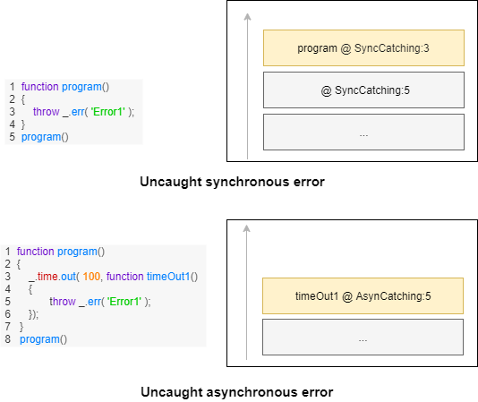

## Mechanisms of catching errors

Describe mechanisms of handling errors, depending on their synchronicity, build, and other circumstances.

Uncaught errors are caught by a special hook, and there are many opinions which strategy application should use to handle such errors.

There are 4 mechanisms of catching an error in JS depending on the source of an error.

- Synchronous catching
- Asynchronous catching
- Synchronous uncaught catching
- Asynchronous uncaught catching

### Synchronous error

The first mechanism is straightforward, `try block` catches a synchronous error, and its corresponding `catch block` handle the error.

``` js
try
{
  throw _.error.err( 'Error!' );
}
catch( err )
{
  console.log( err );
}
```

Nothing special about the code. Routine `_.err` constructs an error.

### Asynchronous error

Asynchronous catching takes place in asynchronous code.

``` js
consequence
.then( function decrement( arg )
{
  if( arg <= 0 )
  throw _.error.err( 'negative!' );
  return arg-1;
})
.then( function divide( arg )
{
  if( arg % 2 === 1 )
  throw _.error.err( 'odd!' );
  return arg*2;
})
.catch( ( err ) =>
{
  console.log( err );
})
```

In this example, errors are thrown by either `callback decrement` or `callback divide` of `Consequence`/`Promise`. `Catch callback` catches and handle such errors in a similar manner as it is done in synchronous error catching, but in this case, the stack could be no the same code throwing error had.

### Uncaught synchronous error

Both browser and NodeJS, as well as most programming environments, provide a mechanism to handle the uncaught error. If `try blocks` fail to process it and there is no `try block` left in the stack, then the error will become uncaught. It generates a special event, and uncaught errors are caught by the handler of uncaught errors.

``` js
process.on( 'uncaughtException', function( err )
{
})
```

NodeJS let developers catch uncaught errors with code above.

``` js
window.onerror = function( err )
{
}
```

Browser let developer catch uncaught errors with code above.

```
--------------- uncaught error --------------->

 = Application
    Current path : /
    Exec path : /bin/node /Once.js

 = Message of error#1
    negative!
    Failed to decrement
    Failed to divide

 = Beautified calls stack
    at decrement (/Once.js:7:13)
    at divide (/Once.js:25:12)
    at Object.<anonymous> (/Once.js:36:1)

 = Throws stack
    caught at decrement @ /Once.js:7
    caught at decrement @ /Once.js:12
    caught at divide @ /Once.js:29
    caught at handleError @ /Setup.s:148

--------------- uncaught error ---------------<
```

Above, you may see the log of uncaught error generated by our applications. Such a report may be complemented by extra information such as process arguments, current path, and other useful for debugging data.

### Uncaught asynchronous error

Similar to uncaught synchronous errors, uncaught asynchronous errors are that which was not handled by `catch block`. The same concept, the difference is synchronicity. In the case of asynchronous error, `catch block` is asynchronous too. Mechanism of synchronous uncaught error handling is built in the language. Unlike synchronous mechanism asynchronous is done by the implementation of `Promise`/`Consequence`, timer or native implementation of event handling mechanism. `Promise`/`Consequence` ( should ) has the static callback to handle such errors. By default, that callback should call the handler of synchronous uncaught error handling.



On the diagram above, you may see the difference between synchronous and asynchronous uncaught errors. Asynchronous error thrown from the callback of asynchronous event "time out". It also could be thrown from the callback of Promise/Consequence or callback of other asynchronous events, for example, "process exit".

### Unattended error

Unattended error is one that didn't get proper handling yet. An uncaught error is one that was caught in the uncaught error handler. Unattended error is not the same as an uncaught error.

``` js
try
{
  /* Throw error. It has state unattended on creation. */
  throw _.error.err( 'Error1' );
}
catch( err )
{
  /* Turns error to attended. */
  _.error.attend( err );
}
```

Routine `_.error.attend` turns error to attend one. Another way to turn it into attended is just logging it: `console.log( err )`

Don't confuse unattended errors and uncaught errors.

### Strategies of handling uncaught errors

There are a few opinions on how to handle uncaught errors.

Some developers do swallowing of errors, ignoring them.

``` js
try
{
  throw _.error.err( 'Error1' );
}
catch( err )
{
}
```

The example above demonstrates the swallowing of the synchronous error `Error1`. Swallowing of error is not a recommended strategy of handling errors.

One of the possible strategies of handing of uncaught errors is halting an application. Another viable and recommended strategy of handling of uncaught errors is halting it only if the error is also unattended. A more sophisticated solution could be procedure-based handling of an uncaught error. It is possible to define different strategies for different procedures of the process.

The release build of an application could restart itself on uncaught error.

Our implementation adopts the strategy to halt the application on synchronous/asynchronous uncaught error, but only if it is unattended.

### Assertions

Assertions are built in source code checks which have precisely the same purpose as unit tests. Because assertions are built-in, unlike unit tests, they produce performance overhead. All assertions should be deleted from release build.

``` js
function divide( a, b )
{
  _.assert( b !== 0 );
  return a / b;
}

divide( 5, 0 );
```

A somewhat trivial example of using asserts. Routine `_.assert` restricts input data, forbidding argument `b` taking value zero.

### Practices and assertions

There are 2 opposite strategies for treating uncertainty during the software development process:

- Deductive: increase input data variation as much as possible at the initial stage and add restrictions during development.
- Inductive: decrease input data variation as much as possible at the initial stage and remove restrictions during development.

Rephrasing: deductive practice is allowing input data to be wild at the beginning of the development process, and inductive practice is forbidding that. Both practices have pros and cons in one or another situation.

The assertion is the mechanism to control the variation of input data of a routine. Adding an assert developer restricts a set of allowed input data. JS, unlike most languages, is not typed, so assert is the mechanism which lets fill the gap made by the decision to give up types.

``` js
function div( a, b )
{
  _.assert( b !== 0 );
  _.assert( _.intIs( a ) );
  _.assert( _.intIs( b ) );
  return ( a - ( a % b ) ) / b;
}

console.log( div( 13, 5 ) );
/* output : 2 */
```

The example above restricts the type of arguments. It does the same thing typing in typed languages does. Arguments `a` allowed to be an integer as well as argument `b`. Additionally, it is forbidden to be zero for argument `b`.

It is a good idea to use assertions heavily to be acknowledged about cases which were not got enough attention from the developer. It is even proper to guard ordinary untested branches and conditions with assertions. It allows us to reach 2 goals: postpone the design of some particular branch of code which is not needed at the moment and to avoid introducing of angry bugs by leaving regions of code which swallows errors.

``` js
function routine( bool )
{
  if( bool )
  {
    console.log( 'Do something' );
  }
  else
  {
    _.assert( 0, 'not implemented' );
    /* throws error "not implemented" */
  }
}

routine( true );
```

The second branch of the example above has implemented the first branch, but the second has unconditional assertion throwing error "not implemented". It allows us to postpone the design of the branch and to be sure no silent bug introduced.

### Inferior of TDD practice

The same trick with assertion could be used for fast prototyping instead of test-driven development practice.

``` js
function routine( bool )
{
  if( bool )
  {
    console.log( 'Do one thing' );
    _.assert( 0, 'not tested' );
    /* throws error "not tested" */
  }
  else
  {
    console.log( 'Do another thing' );
    _.assert( 0, 'not tested' );
    /* throws error "not tested" */
  }
}

routine( true );
```

In the example above, the routine has both branches implemented, but the developer marked them as "not tested". Such assertions throw errors unconditionally. The first time entering the branch developer will become aware of that and will pay attention to test the branch of the routine manually. It allows postponing the moment of manual testing. This practice should be used with caution as test-driven development practice is superior in most cases. The only drawback of TDD is cost.

### Summary

- The language provides mechanisms to catch errors.
- Uncaught error is caught in the handler of uncaught errors.
- There are many strategies to handle uncaught errors. Halting the application if the error is unattended is the recommended one.
- Don't do swallowing of errors.
- Don't confuse unattended errors and uncaught errors.
- The assertion is a mechanism for deductive and inductive practices.
- TDD practice is superior but expensive.
